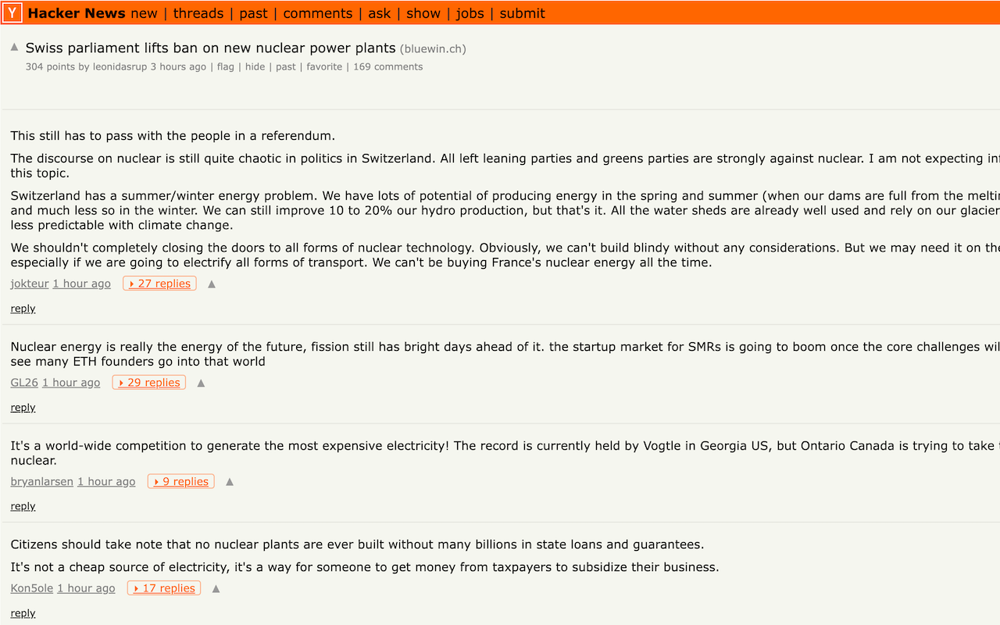

# HN Comments Reader

A Chrome extension that makes reading Hacker News threads easier.

## Features

- **Drill-down view** — A thread opens showing **top-level comments only**, each with a
  badge of how many replies are buried beneath it (`▸ 112 replies`). Click a comment to
  reveal its direct children one level at a time; click again to collapse the subtree.
  Deep nesting is capped so descended levels stay on screen.
- **Markdown rendering** — Comment bodies render the markdown HN leaves as raw text
  (`**bold**`, `` `code` ``, fenced code, `[text](url)`, `-`/`1.` lists, `>` quotes,
  `#` headings, `~~strike~~`, tables). Built on vendored [marked] + [DOMPurify].
- **Tucked-away compose box** — HN's large always-open comment box is hidden; a top-right
  **Add comment** button reveals it. The real form is preserved, so posting still works.

Everything is toggleable from the toolbar popup.

## Install

**[Add to Chrome from the Chrome Web Store →](https://chromewebstore.google.com/detail/hn-comments-reader/oammegfgbfeliilfekapkipnehphppip)**

Or load it unpacked for development:

1. Open `chrome://extensions`, enable **Developer mode**.
2. **Load unpacked** → select this folder.
3. Open any thread, e.g. `https://news.ycombinator.com/item?id=48573332`.

## How it works

HN renders comments as a flat list of `<tr class="athing comtr">` rows in depth-first
order, with depth in `<td class="ind" indent="N">`. The extension reconstructs the tree
from row order + indent and drives the UI purely by showing/hiding HN's own rows, so
voting, reply links, usernames and timestamps keep working untouched.

[marked]: https://github.com/markedjs/marked
[DOMPurify]: https://github.com/cure53/DOMPurify
